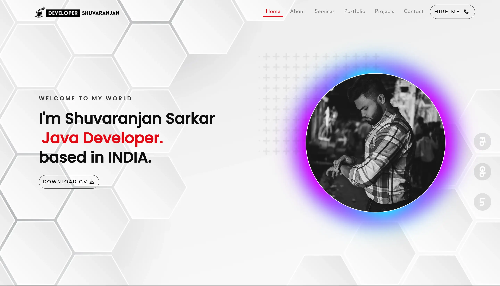
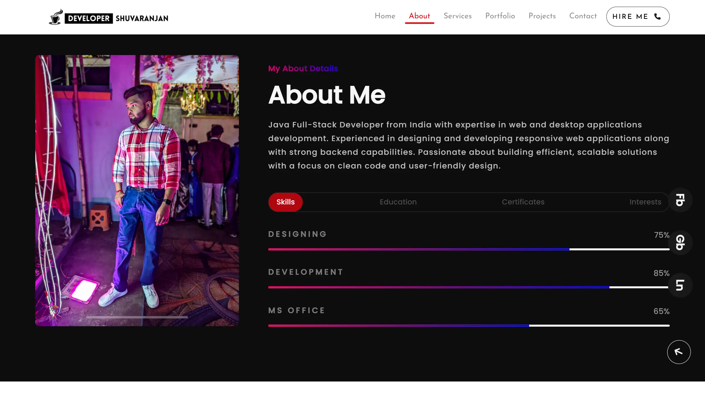
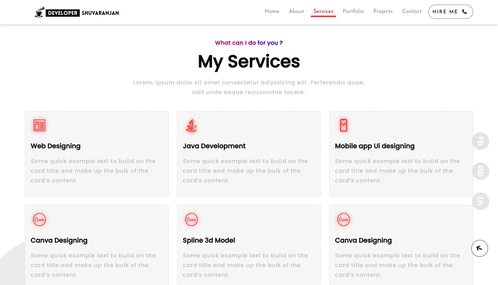
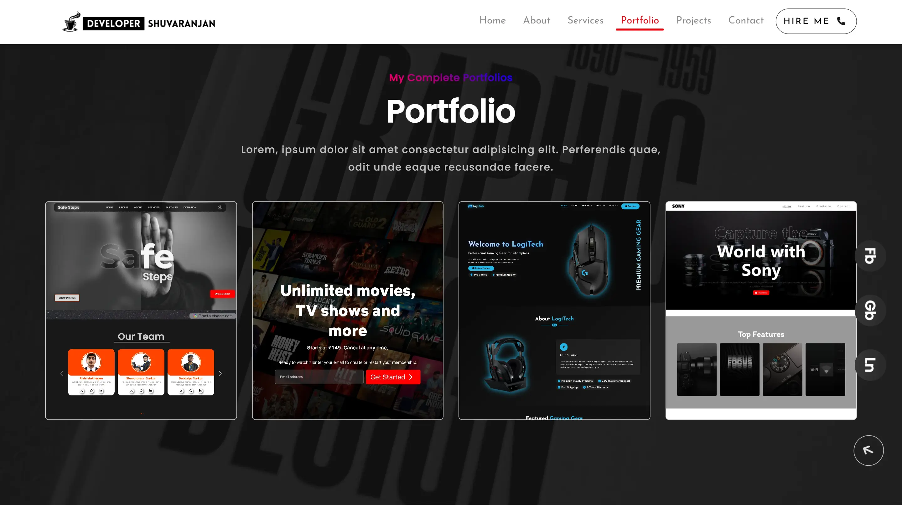
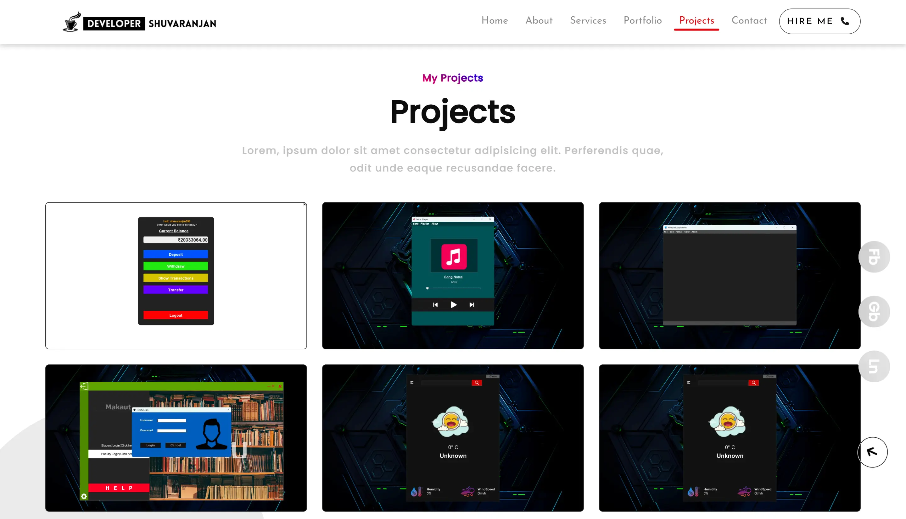
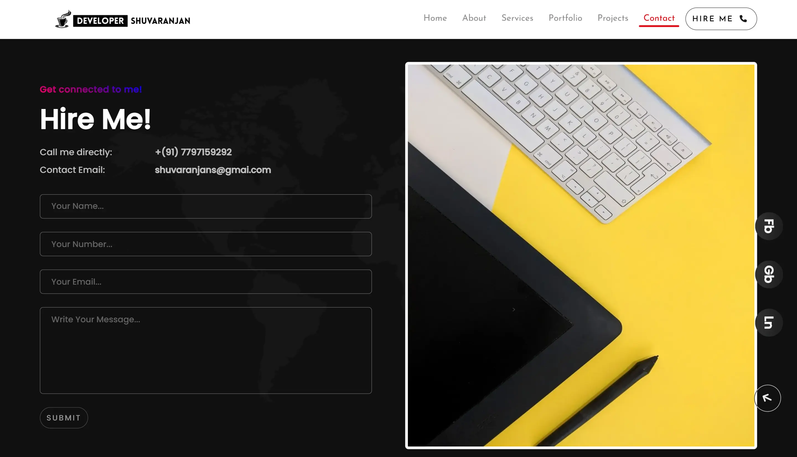

  <h1>Portfolio: Bootstrap</h1> 

🌟 I’m excited to share my new portfolio website that I recently built using HTML, CSS, JavaScript, and Bootstrap 5.

The main goal of this project was to create a modern, fast, and fully responsive portfolio that works seamlessly across mobile, tablet, laptop, and desktop devices. I paid attention not only to the design and layout, but also to performance optimization for a smooth user experience.

<h4>What I implemented:</h4>
<ul>
  
  <li>⚡ Optimized performance by converting all images into WebP format and fonts into WOFF2 format, which ensures faster load times and stress-free rendering.</li>

  <li>🎨 Defined global root variables for colors and font properties, making the design consistent and easy to maintain.</li>

  <li>🧩 Used Bootstrap 5 grid system, cards, and components for flexible and responsive layouts.</li>

  <li>📌 A clean navbar with collapse functionality for better navigation on all devices.</li>

  <li>🖼️ Portfolio showcase section with elegant card hover effects and smooth scroll-to-view interactions.</li>

  <li>💻 Built with the mindset of scalability, readability, and maintainability for long-term growth.</li>
  
</ul>

This portfolio is not just a collection of my work, but also a reflection of my frontend development skills, attention to detail, and commitment to building fast, user-friendly web applications.

🚀 I’m constantly exploring new technologies and improving my skills, and this project gave me another opportunity to refine my knowledge in Bootstrap, responsive design, performance optimization, and UI/UX principles.

<!-- 

 -->

